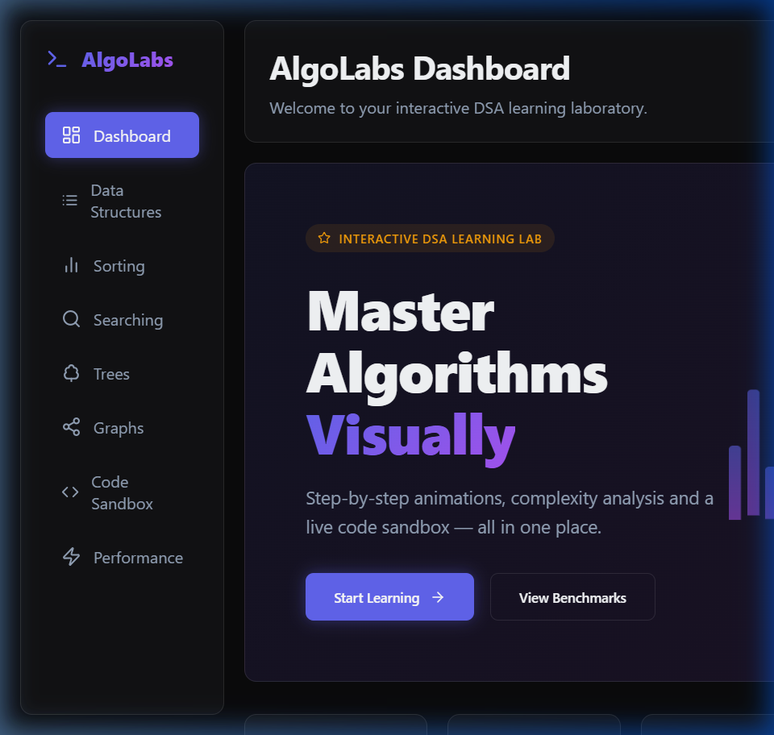

# AlgoLabs - Interactive DSA Learning Laboratory



AlgoLabs is an interactive platform designed to help students and developers master Data Structures and Algorithms (DSA) through step-by-step visual animations, complexity analysis, and a live code sandbox.

## 🎥 Demo Video


## 🚀 Features

- **Sorting Algorithms**: Visualize how algorithms like Bubble Sort, Merge Sort, Quick Sort, and Heap Sort organize data.
- **Searching Algorithms**: Interactive tracing of Linear Search and Binary Search.
- **Data Structures**: Real-time manipulation of Arrays, Singly Linked Lists, Stacks, and Queues.
- **Trees**: Explore Binary Search Tree (BST) insertions, deletions, and various traversal methods.
- **Graphs**: Create interactive graphs and visualize traversal algorithms like BFS and DFS.
- **Algorithm Sandbox**: A built-in code editor (powered by Monaco) to write, test, and run your own algorithms in-browser.
- **Performance Benchmarks**: Compare time and space complexities visually with data-driven charts.

## 🛠️ Tech Stack

### Frontend
- **React** with **TypeScript**
- **Vite** for fast development and building
- **Lucide React** for modern iconography
- **Framer Motion** for smooth, fluid animations
- **Chart.js** & **React-Chartjs-2** for performance metrics
- **D3.js** for complex data visualizations
- **Monaco Editor** for the integrated code sandbox

### Backend
- **FastAPI** (Python) for a lightweight and high-performance API.

## 📦 Getting Started

### Prerequisites
- Node.js (v18 or higher)
- Python 3.8+

### Installation

1. **Clone the repository:**
   ```bash
   git clone https://github.com/systemwithayush/Algo--visualization.git
   cd Algo--visualization
   ```

2. **Frontend Setup:**
   ```bash
   cd frontend
   npm install
   npm run dev
   ```

3. **Backend Setup:**
   ```bash
   cd ../backend
   # It is recommended to use a virtual environment
   python -m venv venv
   source venv/bin/activate # On Windows use `venv\Scripts\activate`
   pip install fastapi uvicorn
   uvicorn main:app --reload
   ```

## 🧪 Usage

Once both servers are running:
- Open your browser and navigate to `http://localhost:5173` (or the port specified by Vite).
- Use the sidebar to switch between different visualization modules.
- Interact with the visualizers using the control panels provided in each section.

## 📄 License

This project is open-source and available under the MIT License.
